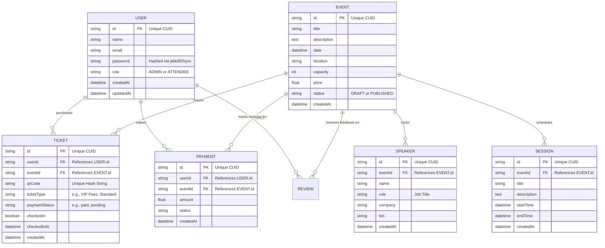

# EventFlow Entity-Relationship (ER) Diagram 📊

This file contains the strict relational database mapping and cardinality rules for the EventFlow MySQL Database. 
You can paste the code block below into [Mermaid Live Editor](https://mermaid.live/) to instantly generate a professional diagram graphic for your project report!

